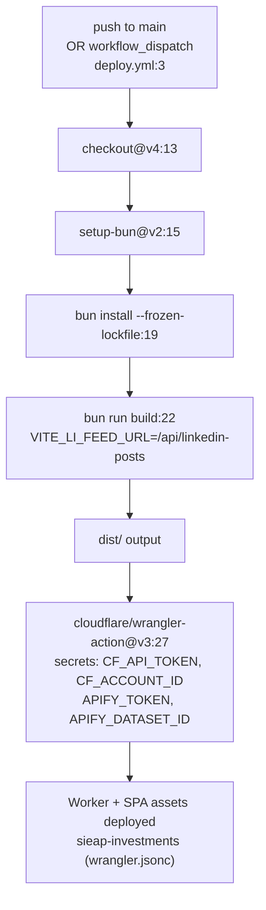
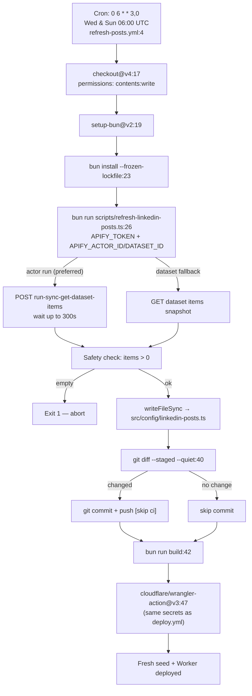

# CI/CD Pipeline — Flowchart

## Deploy Workflow (push to main)

## Refresh Posts Workflow (scheduled)

## Secrets Required

| Secret | Used In | Purpose |
|--------|---------|---------|
| `CLOUDFLARE_API_TOKEN` | Both workflows | Wrangler deploy auth |
| `CLOUDFLARE_ACCOUNT_ID` | Both workflows | Wrangler deploy target |
| `APIFY_TOKEN` | refresh-posts.yml, worker.ts | Apify API auth |
| `APIFY_ACTOR_ID` | refresh-posts.yml, worker.ts | Preferred: triggers fresh scrape |
| `APIFY_DATASET_ID` | refresh-posts.yml, worker.ts | Legacy: reads fixed snapshot |

## Remaining Duplication

`deploy.yml:19-37` and `refresh-posts.yml:42-59` share identical build+deploy steps (22 lines). Extract to `.github/workflows/build-and-deploy.yml` (reusable `workflow_call`) if these steps need to change frequently.
