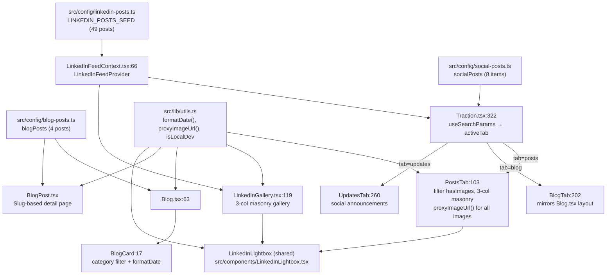

# Content Hub (Blog + Traction + Gallery) — Flowchart

## Shared Components & Utilities (post-unification)

| Component/Utility | Source | Used By |
|---|---|---|
| `LinkedInLightbox` | `src/components/LinkedInLightbox.tsx` | Traction.tsx, LinkedInGallery.tsx |
| `proxyImageUrl()` | `src/lib/utils.ts` | Traction.tsx, LinkedInGallery.tsx, LinkedInLightbox.tsx |
| `formatDate()` | `src/lib/utils.ts` | Traction.tsx, LinkedInGallery.tsx, Blog.tsx, BlogPost.tsx, Gallery.tsx, Index.tsx |
| `isLocalDev` | `src/lib/utils.ts` | (consumed by proxyImageUrl) |

## Previously Duplicated (now unified)

| Was duplicated in | Extracted to |
|---|---|
| `Traction.tsx:43-99`, `LinkedInGallery.tsx:61-117` | `src/components/LinkedInLightbox.tsx` |
| `Traction.tsx:18-31`, `LinkedInGallery.tsx:11-22`, `Blog.tsx:13`, `BlogPost.tsx:9`, `Gallery.tsx:14`, `Index.tsx:63` | `src/lib/utils.ts` |
