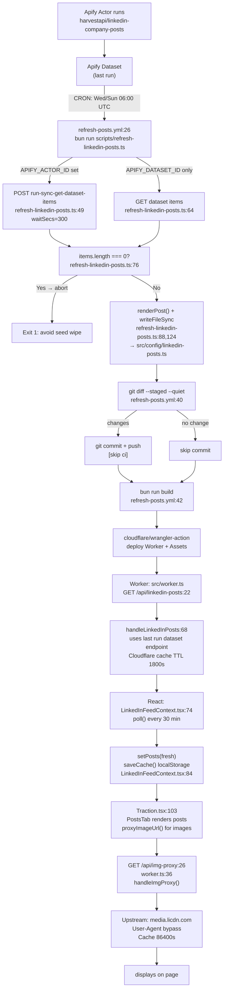

# LinkedIn Feed System — Flowchart

## Key Files

| File | Role |
|------|------|
| `scripts/refresh-linkedin-posts.ts` | Apify runner — triggers actor or reads dataset |
| `src/config/linkedin-posts.ts` | Seed file — auto-generated, committed to repo |
| `.github/workflows/refresh-posts.yml` | Scheduler — runs Wed/Sun 06:00 UTC |
| `src/worker.ts:68` | API endpoint — serves fresh data from Apify last-run |
| `src/contexts/LinkedInFeedContext.tsx` | Client polling — 30-min interval, localStorage cache |
| `src/lib/utils.ts` | `proxyImageUrl()` — routes images through Worker proxy |
| `src/components/LinkedInLightbox.tsx` | Shared modal for image + content display |
