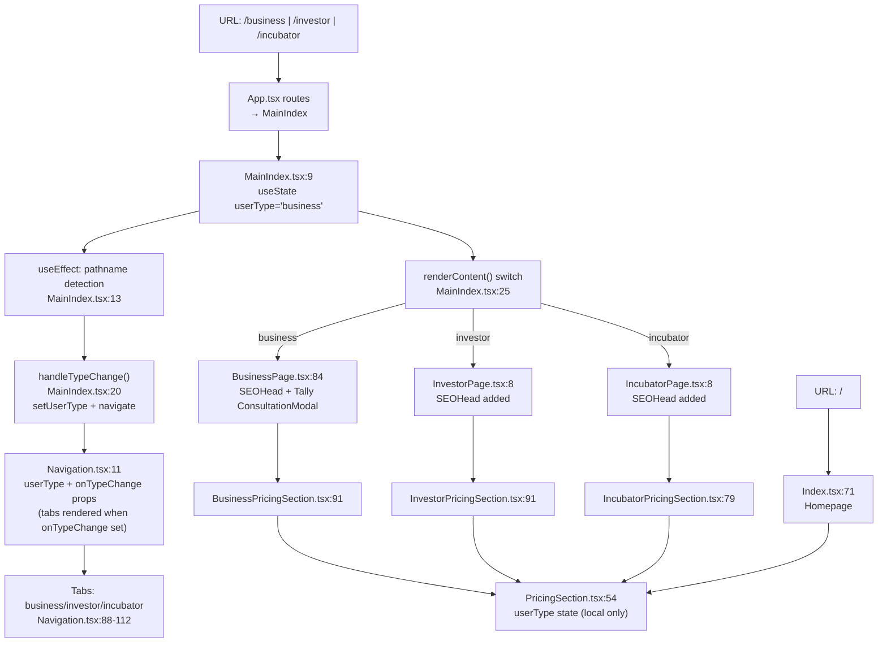

# Platform Routing & Role Pages — Flowchart

## Notes

- `Navigation.tsx` conditionally renders role-switcher Tabs **only** when `onTypeChange` prop is provided (role pages). `Index.tsx` passes no props — tabs hidden on homepage. This is intentional.
- `UserTypeContext.tsx` was defined but never provided in `App.tsx` — removed (dead code). `PricingSection.tsx` now uses local state only.
- All three role pages now have `<SEOHead>` for proper search indexing.
