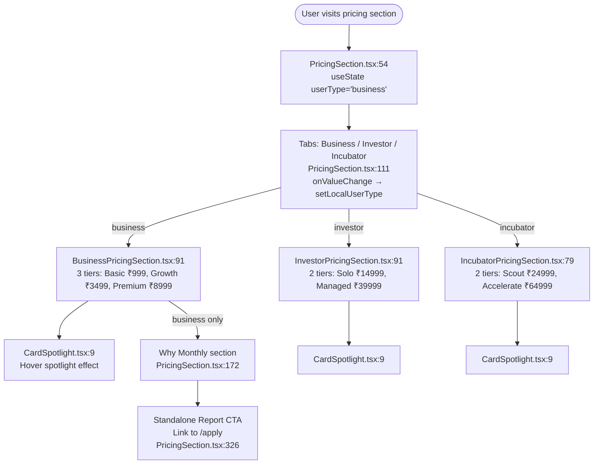

# Pricing System — Flowchart

## Pricing Tiers

### Business
| Tier | Price | Popular |
|------|-------|---------|
| Basic | ₹999/mo | No |
| Growth | ₹3,499/mo | Yes |
| Premium | ₹8,999/mo | No |

### Investor
| Tier | Price | Popular |
|------|-------|---------|
| Solo Investor | ₹14,999/mo | No |
| Managed Investor | ₹39,999/mo | Yes |

### Incubator
| Tier | Price | Popular |
|------|-------|---------|
| Scout Incubator | ₹24,999/mo | No |
| Accelerate Incubator | ₹64,999/mo | Yes |

## Remaining Duplication (not yet unified)

The three `*PricingSection` components share ~85% identical structure (CardSpotlight wrapper, CheckCircle features list, conditional button styling, identical Framer Motion animations). A generic `<PricingTier>` component could eliminate ~70 LOC. See `04-handoff-prompts.md` if this becomes a priority.
