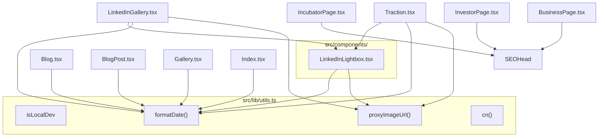

# Unified Proposal — SIEAP Investments

> Generated: 2026-05-01 | Principle: Delete, don't abstract

## Implemented ✅

### System A: Shared Media Utilities → `src/lib/utils.ts`

Added `isLocalDev`, `proxyImageUrl(url)`, and `formatDate(iso, locale?)` to the existing `src/lib/utils.ts`.  
Previously duplicated across 6–8 files. Now a single source of truth.

**Call sites updated**: Traction.tsx, LinkedInGallery.tsx, Blog.tsx, BlogPost.tsx, Gallery.tsx, Index.tsx

---

### System B: Shared `LinkedInLightbox` Component

Extracted the 57-line `Lightbox` component (byte-for-byte identical in Traction.tsx and LinkedInGallery.tsx) to `src/components/LinkedInLightbox.tsx`.

**~54 LOC removed** from the codebase.

---

### System C: SEO Metadata on Role Pages

Added `<SEOHead>` to `BusinessPage.tsx`, `InvestorPage.tsx`, and `IncubatorPage.tsx`.  
These pages are routed at `/business`, `/investor`, `/incubator` and were previously invisible to search engines.

---

### System D: Remove `UserTypeContext` Dead Code

Deleted `src/contexts/UserTypeContext.tsx` (28 lines). This context was defined but never provided — `App.tsx` never wrapped children with `<UserTypeContextProvider>`, so every consumer always received the default value.

`PricingSection.tsx` now uses local `useState` only (it was already the effective code path).

---

## Pending ⏳

### System E: Generic `PricingTier` Component (Optional)

`BusinessPricingSection.tsx`, `InvestorPricingSection.tsx`, and `IncubatorPricingSection.tsx` share ~85% identical tier card markup. Estimated ~70 LOC savings from a generic `<PricingTier>` component. Medium effort, low urgency.

### System F: CI/CD Reusable Workflow (Optional)

`deploy.yml` and `refresh-posts.yml` duplicate 22 lines of build+deploy YAML. Extract to `.github/workflows/build-and-deploy.yml` (`on: workflow_call`). Low effort, low urgency.

---

## Unified Architecture (current state)

